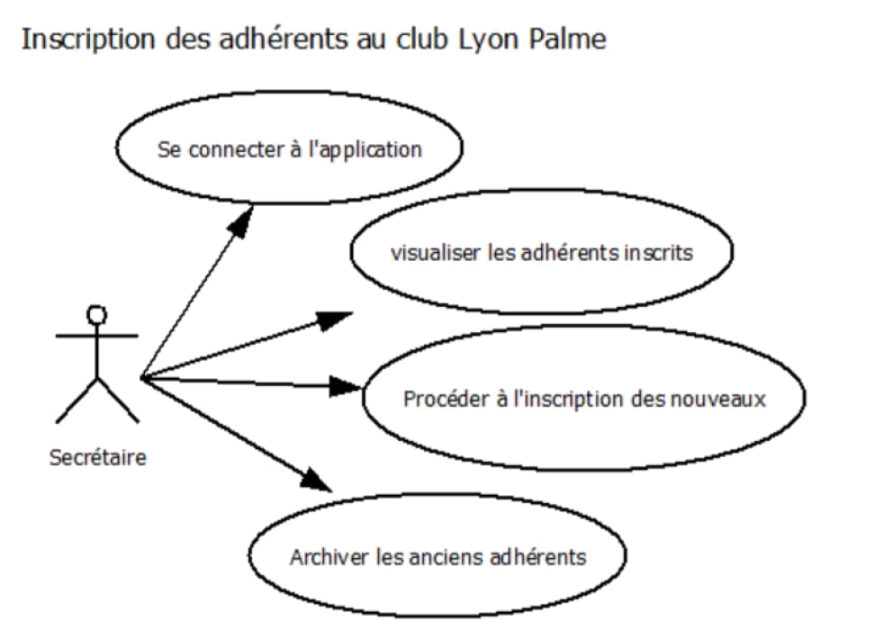
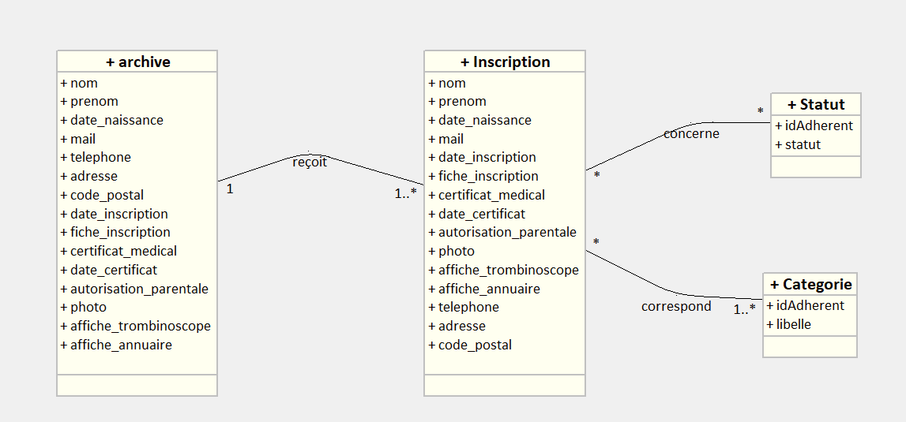
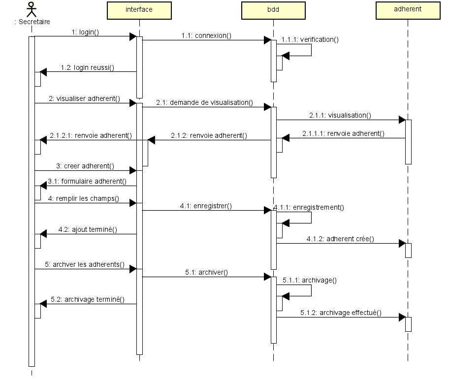

<h1 align="center">LyonPalme · Application d'inscription des adhérents</h1>
<p align="center">
  <a href="#apropos">À propos</a> ·
  <a href="#technologies">Technologies</a> ·
  <a href="#structure">Structure</a> ·
  <a href="#installation">Installation</a> ·
  <a href="#authentification">Authentification</a> ·
  <a href="#navigation">Navigation</a> ·
  <a href="#annexes">Annexes</a> ·
  <a href="#remerciements">Remerciements</a>
</p>
<p align="center">
  
  
</p>

```
                                                                                  
  _                       _____      _                
 | |                     |  __ \    | |               
 | |    _   _  ___  _ __ | |__) |_ _| |_ __ ___   ___ 
 | |   | | | |/ _ \| '_ \|  ___/ _` | | '_ ` _ \ / _ \
 | |___| |_| | (_) | | | | |  | (_| | | | | | | |  __/
 |______\__, |\___/|_| |_|_|   \__,_|_|_| |_| |_|\___|
         __/ |                                        
        |___/                                         
```

## Sommaire
1. [À propos](#apropos)  
   1.1. [Présentation générale](#presentation-generale)  
   1.2. [Equipe & encadrement](#equipe-encadrement)  
2. [Technologies & savoir-faire](#technologies)  
3. [Structure du dépôt](#structure)  
4. [Installation & prérequis](#installation)  
   4.1. [Environnement logiciel requis](#env-requis)  
   4.2. [Préparation de l'environnement](#env-preparation)  
   4.3. [Installation des dépendances](#installation-dependances)  
   4.4. [Base de données](#installation-bdd)  
   4.5. [Compte SSMS](#installation-ssms)  
   4.6. [Configuration de l'application](#installation-configuration)  
5. [Authentification & comptes](#authentification)  
6. [Navigation & formulaires](#navigation)  
7. [Utilisation & scénarios](#utilisation)  
8. [Annexes & ressources](#annexes)  
9. [Remerciements](#remerciements)

## <a id="apropos"></a>À propos
<a id="presentation-generale"></a>
Projet personnel encadré réalisé par **Yasser Bouraghda, Tom Perrat, Milan Beretoni et Valentin Peries**, étudiants en 2ᵉ année de **BTS Services Informatiques aux Organisations – option SLAM** à Sup'Chassagnes (Oullins, 69), sous la supervision de Mme Chataing.  

L'application web LyonPalme gère l'inscription et le suivi des adhérents du club (projet fictif) :
- Les secrétaires administrent les comptes, archivent les anciens membres et suivent les cotisations.
- Les nageurs consultent le trombinoscope et mettent à jour leurs informations personnelles.

Cette version enrichie du README conserve l’intégralité des informations d’origine tout en offrant une présentation plus structurée et moderne, inspirée des standards de documentation professionnels.

<a id="equipe-encadrement"></a>
- **Equipe projet** : Yasser Bouraghda, Tom Perrat, Milan Beretoni, Valentin Peries  
- **Encadrement** : Mme Chataing – Sup'Chassagnes (69)  

<p align="right"><a href="#top">⬆ Retour en haut</a></p>

## <a id="technologies"></a>Technologies & savoir-faire
<table align="center">
  <tr>
    <td align="center" width="150">
      <a href="https://www.python.org/" target="_blank" rel="noreferrer">
        
        <br /><sub><strong>Python 3.11</strong></sub>
      </a>
    </td>
    <td align="center" width="150">
      <a href="https://www.djangoproject.com/" target="_blank" rel="noreferrer">
        
        <br /><sub><strong>Django 4.2.x</strong></sub>
      </a>
    </td>
    <td align="center" width="150">
      <a href="https://getbootstrap.com/" target="_blank" rel="noreferrer">
        
        <br /><sub><strong>Bootstrap 5</strong></sub>
      </a>
    </td>
    <td align="center" width="150">
      <a href="https://www.sqlite.org/" target="_blank" rel="noreferrer">
        
        <br /><sub><strong>SQLite chiffrée</strong></sub>
      </a>
    </td>
  </tr>
</table>

- **Framework : Django**
  - Templates : Bootstrap, HTML
  - Models : mappage ORM, migrations
  - Views : vues fonctionnelles, contrôles métiers
  - URLs : routage côté application
- **Fichier `requirements.txt`** : `django-cryptography`, `Pillow`, `psycopg2`, `asgiref`, `sqlparse`, `cffi`, `cryptography`, `pycparser`, `django-appconf`
- **Données**
  - Base locale : SQLite (liens 1 à n, chiffrement des données sensibles)
  - Modélisation : UML, MCD, diagrammes de séquence
- **Outils** : Git, Debian, Visual Studio Code 2019/2022
- **Librairies transverses** :
  - `django-cryptography` pour le chiffrement transparent des champs
  - `Pillow` pour la gestion des fichiers image (photos, certificats)
  - `psycopg2` pour l’ouverture future vers PostgreSQL
- **Versions utilisées lors du développement** :
  - Django 4.2.2
  - Python 3.11.4
  - Debian (distribution de référence)
  - VSCode 1.78.2

<p align="right"><a href="#top">⬆ Retour en haut</a></p>

## <a id="structure"></a>Structure du dépôt
```
Lyonpalme_exam/
├── README.md
├── dossier_technique/
│   ├── MCD.png
│   ├── UML.png
│   ├── sequence.png
│   └── userstory.png
└── lyon_palme/
    ├── inscription/
    │   ├── forms.py
    │   ├── logger.py
    │   ├── models.py
    │   ├── regex.py
    │   ├── static/
    │   ├── templates/
    │   ├── urls.py
    │   └── views.py
    ├── lyon_palme/
    │   ├── settings.py
    │   ├── urls.py
    │   ├── asgi.py
    │   └── wsgi.py
    ├── manage.py
    └── requirements.txt
```

<p align="right"><a href="#top">⬆ Retour en haut</a></p>

## <a id="installation"></a>Installation & prérequis
<a id="env-requis"></a>
### 1. Environnement logiciel requis
-  Python 3 (3.11.4 utilisé, compatible 3.10+)
-  Django 4.2.2
-  Debian (ou distribution équivalente)
-  Visual Studio Code 2019/2022

<a id="env-preparation"></a>
### 2. Préparation de l'environnement
```bash
cd inscriptions_lyon_palmes/
sudo apt update
sudo apt install python3-pip
sudo apt-get install python3-venv
python3 -m venv venv
source venv/bin/activate  # Windows : venv\Scripts\activate
```

<a id="installation-dependances"></a>
### 3. Installation des dépendances
```bash
cd lyon_palme/
pip install -r requirements.txt
```
> Astuce : exécuter `pip list --format=columns` après installation pour vérifier que les versions attendues sont bien installées.

<a id="installation-bdd"></a>
### 4. Base de données
La base **SQLite** est embarquée et ne nécessite ni identifiant ni mot de passe.
- Pour développer sur une base distante (PostgreSQL ou MySQL), prévoir la mise à jour de `settings.py`.
- Les champs sensibles sont chiffrés via `django-cryptography`.

<a id="installation-ssms"></a>
### 5. Compte SSMS pour se connecter à la base de données
Les logins dédiés ne sont **pas nécessaires** : la base SQLite locale ne requiert ni utilisateur ni mot de passe, ce qui simplifie le CRUD pendant le développement.

<a id="installation-configuration"></a>
### 6. Configuration de l'application pour la connexion à la base
- Les paramètres par défaut de `lyon_palme/settings.py` pointent vers la base SQLite embarquée.
- Pour un futur passage sur PostgreSQL/MySQL, adapter les paramètres `ENGINE`, `NAME`, `USER`, `PASSWORD`, `HOST`, `PORT`.

#### Chaînes de connexion
En configuration locale, aucune chaîne de connexion supplémentaire n’est requise grâce à l’usage de SQLite. Pour un SGBD distant, documenter la chaîne dans `settings.py` ou dans des variables d’environnement.

<p align="right"><a href="#top">⬆ Retour en haut</a></p>

## <a id="authentification"></a>Authentification & comptes
### Vue d'ensemble
- Les secrétaires utilisent un compte superutilisateur Django.
- Les nageurs disposent de comptes créés automatiquement par les secrétaires lors de l'inscription.
- Les mots de passe par défaut sont régénérés et contrôlés par une politique stricte (voir `Regex.verif_mdp`).

### Compte secrétaire
Pour créer un compte secrétaire :
```bash
python3 manage.py createsuperuser
Nom d’utilisateur: secretaire
Email d’utilisateur: secretaire@gmail.com
Password d’utilisateur: C1Secret!
```

| Identifiant | Mot de passe |
|-------------|--------------|
| secretaire  | C1Secret!    |

### Comptes adhérents
Création par un secrétaire via le formulaire d'inscription :
```text
Identifiant = initiale du prénom + nom (ex. jdupont)
Mot de passe = date de naissance AAAAMMJJ
```
| Identifiant | Mot de passe |
|-------------|--------------|
| nageur      | AAAAMMJJ     |

- À la première connexion, un nageur est redirigé vers le formulaire de changement de mot de passe.
- L'attribut `login_count` stocké dans `Inscription` permet de contrôler cette obligation.

<p align="right"><a href="#top">⬆ Retour en haut</a></p>

## <a id="navigation"></a>Navigation & formulaires
### Accueil public
- URL : `http://127.0.0.1:8000/inscription/`
- Présente le club, la politique de confidentialité  
  (`http://127.0.0.1:8000/inscription/politique_confidentialite`)  
- Barre de navigation menant vers les portails Secrétaire et Nageur

### Portail de connexion
| Formulaire | URL                                               | Rôle |
|------------|---------------------------------------------------|------|
| Nageur     | `http://127.0.0.1:8000/inscription/login_nageur`  | Accès à l’espace nageur, mot de passe oublié |
| Secrétaire | `http://127.0.0.1:8000/inscription/login_secretaire` | Accès à l’espace secrétaire |

### Espace nageur
- URL : `http://127.0.0.1:8000/inscription/accueil_nageur`
- Fonctions : consulter/modifier les données personnelles, accéder au trombinoscope, se déconnecter, revenir à l’accueil.

### Espace secrétaire
- URL : `http://127.0.0.1:8000/inscription/accueil_secretaire`
- Fonctions :
  - Modifier son mot de passe
  - Consulter la liste des nageurs
  - Modifier et archiver les fiches adhérents
  - Administrer les inscriptions et vérifier la politique de confidentialité

<p align="right"><a href="#top">⬆ Retour en haut</a></p>

## <a id="utilisation"></a>Utilisation & scénarios
### Présentation de l’application
L’outil centralise la gestion des adhérents du club (fictif) : inscription, suivi des documents, gestion des droits d’affichage (trombinoscope, annuaire) et archivage. Les secrétaires pilotent l’ensemble des actions quotidiennes tandis que les adhérents disposent d’un accès autonome.

### Parcours type
1. **Secrétaire** se connecte via `/login_secretaire`.
2. Crée un nouvel adhérent via le formulaire dédié (`inscription_form`).
3. Le nouvel adhérent se connecte sur `/login_nageur` avec l’identifiant généré et sa date de naissance.
4. À la première connexion, il est redirigé vers `/change_password` pour personnaliser son mot de passe.
5. Il accède ensuite à son tableau de bord `/accueil_nageur`, peut modifier ses informations et consulter le trombinoscope.

### Points de vigilance
- Le formulaire de modification (`modification_form.html`) est mutualisé côté secrétaire et nageur mais l'accès est contrôlé par des décorateurs `@login_required` et des tests sur `is_superuser`.
- La suppression d'un adhérent passe par l'archivage : `Archive` conserve l'historique (lien direct dans `views.archiver_nageur`).

### Technologies en pratique
- Templates : interface responsive Bootstrap/HTML
- Views : contrôles métiers et gestion des flux secrétaires/nageurs
- Models : données chiffrées (`django-cryptography`) et fichiers justificatifs (`ImageField`)
- Regex : validations d’e-mails, téléphones, codes postaux et politique de mot de passe

### Notes sur la migration
- Des scripts internes (non publiés) ont permis de migrer les données Access vers SQLite/MySQL durant le projet.
- Le chiffrement de `Inscription` et `Archive` assure la conformité RGPD.

<p align="right"><a href="#top">⬆ Retour en haut</a></p>

## <a id="annexes"></a>Annexes & ressources
- **User Story** – description des rôles et parcours principaux  
  <p align="center"></p>

- **Modèle Conceptuel de Données (MCD)** – structuration des entités et relations  
  <p align="center"></p>

- **Diagramme de classes UML** – représentation orientée objet des modèles Django  
  <p align="center"></p>

- **Diagramme de séquence** – scénario type d'inscription et d'interaction secrétaires/nageurs  
  <p align="center"></p>

- Documentation fonctionnelle et dossiers annexes : `dossier_technique/`

<p align="right"><a href="#top">⬆ Retour en haut</a></p>

## <a id="remerciements"></a>Remerciements
MERCI  
Sources pédagogiques mobilisées :
- **Mme Chataing** – cours en ligne Teams
  - [La formation complète Django (2022)](https://www.youtube.com/watch?v=Bn0k9DDYBZM&t=5502s)
  - [Django Python](https://www.youtube.com/watch?v=tZ4LXyJAj3w&list=PLh-rUZWaw76H5XOcYneHhuvypENDCkpAf)

<p align="right"><a href="#top">⬆ Retour en haut</a></p>
